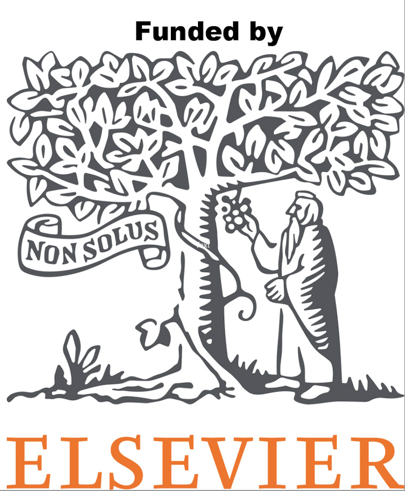

#### Recent Presentations

 

 **2024 Events**

  - University of Hong Kong, China (July 9, 2024).
    "Open Education and Competency-Based Training in Research Data Services: Lessons Learned." Invited talk to Faculty of Education. 
    -  <a href="https://drive.google.com/file/d/1dap4u0oHch2zZi4hJ3s6dlKCjyAk6rrI/view?usp=sharing" target="_blank">Summary of the Talk </a>

  - Symposium in Open Science and Data Curation, Taipei, Taiwan (May 28, 2024).
    "Practical Implementation of Open Education and Competency-Based Training in Research Data Services: Lessons Learned from RDMLA and DSCPE." .
    - <a href="https://www.lib.ntu.edu.tw/events/2024_RDMLA/" target="_blank">Summary of the Talk </a>

  - MLA Annual Conference, Portland (May 18-21, 2024)
 
  - iConference, Changchun, China (April 24, 2024)
    - <a href="https://www.ischools.org/iconference-agenda" target="_blank">Session Overview </a>

___    
**2023 Events**

  - ALISE 2023 Annual Conference (October 3, 2023) – Presentation
    - <a href="https://github.com/dscpe/dscpe.github.io/blob/main/images/presentations/2023/2023_ALISE_Juried_Paper_Presentation%20(1).pdf" target="_blank">Presentation Slides</a>

  - MLA SLA Annual Meeting (May 18, 2023) – Presentation
    - <a href="https://github.com/dscpe/dscpe.github.io/blob/main/images/presentations/2023/Thomas_DSCPE_MLA23_Presentation.pdf" target="_blank">Presentation Slides</a>

  - iSchools iConference (March 27, 2023) – Workshop
    - <a href="https://github.com/dscpe/dscpe.github.io/blob/main/images/presentations/2023/2023%20iConference%20workshop_data%20competencies.pdf" target="_blank">Presentation Slides</a>

___
**DSCPE Alumni Presentations**

A huge congratulations to Fall 2022 cohort members Lucy Carr Jones and Sara Hoover for their recent poster presentations at the Medical Library Association Annual Meeting 2023 in Detroit! And double congrats to Lucy for being awarded 'Best Research Poster' at the conference!

View Lucy and Sara's posters below:
  * Jones, L.C. & Phegley, L. (2023, March 16-19). <a href="https://doi.org/10.18130/1ja6-kh92" target="_blank">Classifying data management plan guidance using DMPTool</a> [Poster presentation]. 2023 Hybrid Medical Library Association and Special Library Association meeting, Detroit, MI.
  * Hoover, S. (2023, March 16-19). <a href="https://1fb872b80d3df585b41f-41f06c41ae393ec809a826abae176f86.ssl.cf1.rackcdn.com//2357234-1683299789.pdf" target="_blank">The Data Services Continuing Professional Education (DSCPE) Program: Creating Communities of Practice for Data Services Librarianship</a> [Poster presentation]. 2023 Hybrid Medical Library Association and Special Library Association meeting, Detroit, MI.

<body>
    

        <a href="https://www.elsevier.com" target="_blank">
         
 
</a>
    
</body>
         
